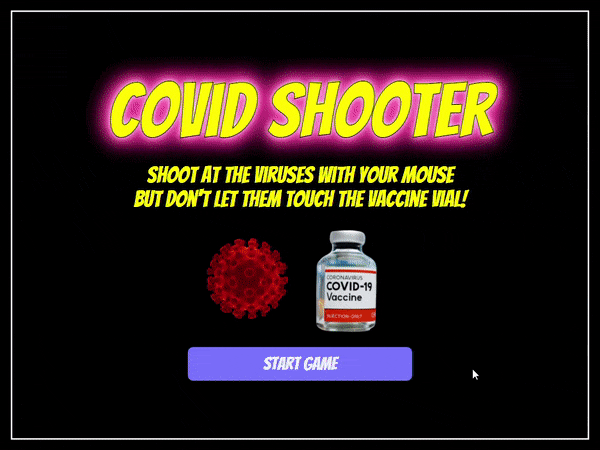

<p align="center">
    
</p>

<p align="center">
    <h1 align="center">Covid Shooter</h1>    
</p>

<p align="center">
    <h2 align="center">An interactive 2D shooting game using Javascript and HTML5 Canvas </br></br>
    Start playing <a href="https://hwkcode.github.io/CovidShooter/"><strong>here!</strong></a>
    </h2>   
    
</p>

<p align="center">
    
    
    
    
    
</p>

<p>
    <h2>Overview</h2>
    Use your cursor to shoot vaccine shots at the incoming coronaviruses! Gain 10 points with each virus you neutralize. The game becomes increasingly difficult over           time as the velocity of the next new virus gets faster and faster. The game is over when a virus touches the vaccine vial.
</p>

<p>
    <h2>Technologies Used</h2>
    <ul>
        <li><b>HTML5 Canvas</b> to draw and render images</li>
        <li><b>Javascript</b> for game functionality</li>
        <li><b>npm</b> for package installation and dependency management</li>
        <li><b>Webpack and Babel</b> to bundle and transpile JavaScript files</li>
        <li><b>Freesound API</b> for sound effects</li>
    </ul>
</p>

## Featured Code Snippet

Shooting vaccine shots from vial:

* <b>Math.atan2()</b> is used to return the angle (in radians) between wherever the player clicked on the canvas and the top of the vaccine vial.
* Because the click event listener only applies to the canvas, <b>getBoundingClientRect()</b> was needed to return the value of the canvas relative to the viewport along with the coordinates of the top of the vial.
* The <b>UUID npm package</b> was used to assign a unique key to each vaccine added to the Vaccines object.

```
handleShoot = (event) => {
    shootSound.currentTime = 0;
    shootSound.play();
    const bounds = event.target.getBoundingClientRect();
    const angle = Math.atan2(event.clientY - bounds.top - 237.1, event.clientX - bounds.left - 400);
    const velocity = { x: Math.cos(angle) * 5, y: Math.sin(angle) * 5 };
    vaccines[uuidv4()] = new Vaccine(400, 237.1, 3, 'white', velocity);
};
```

